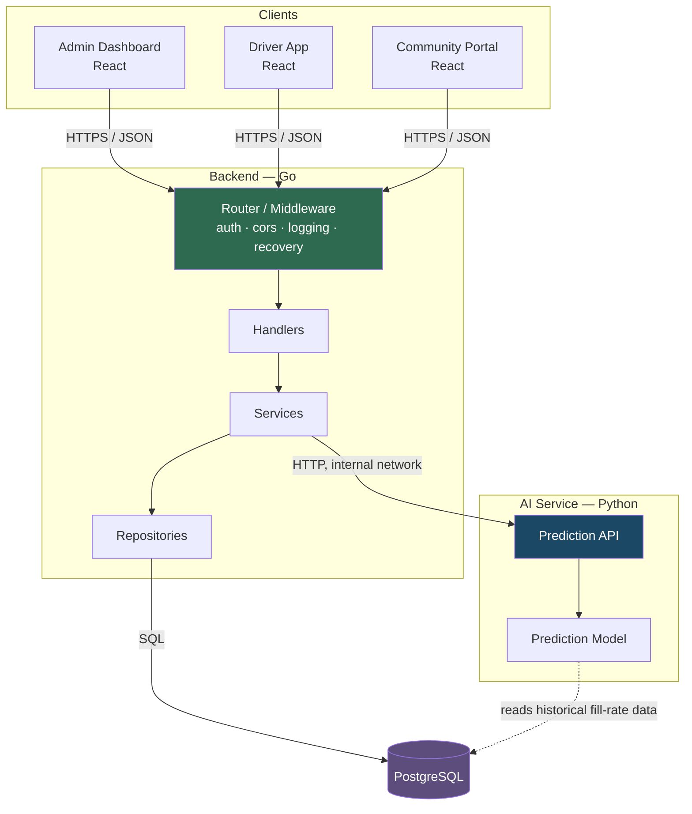
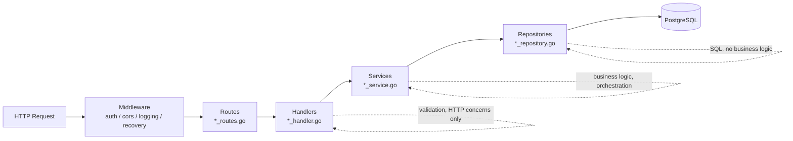
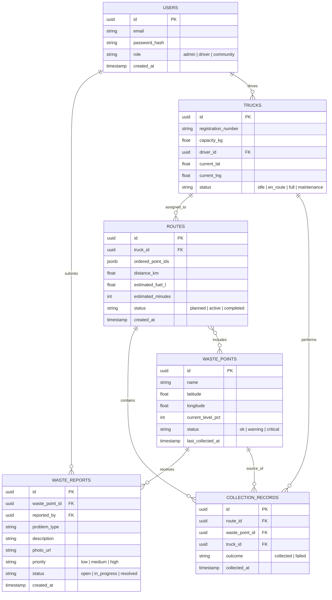
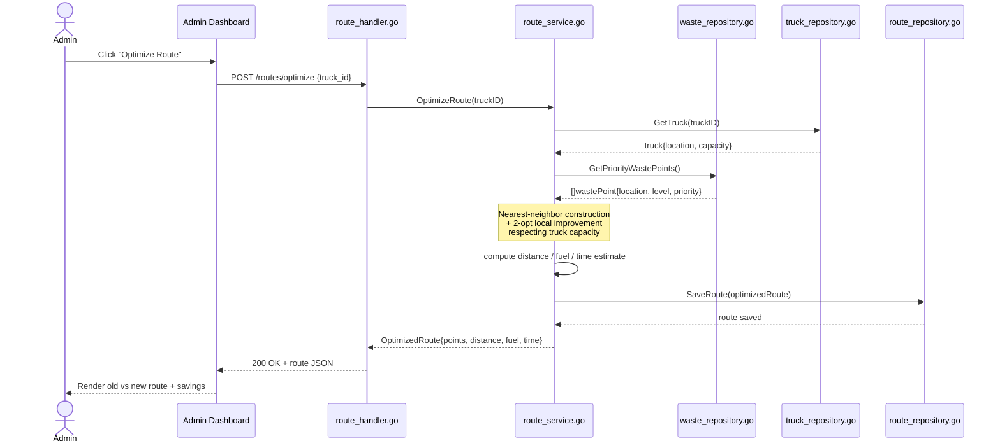
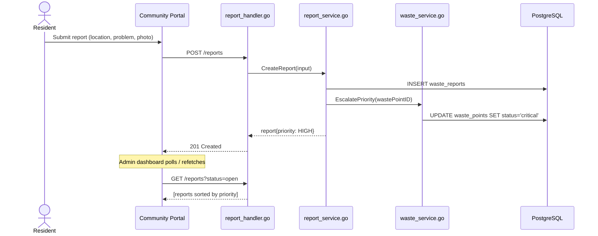
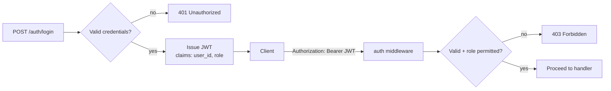
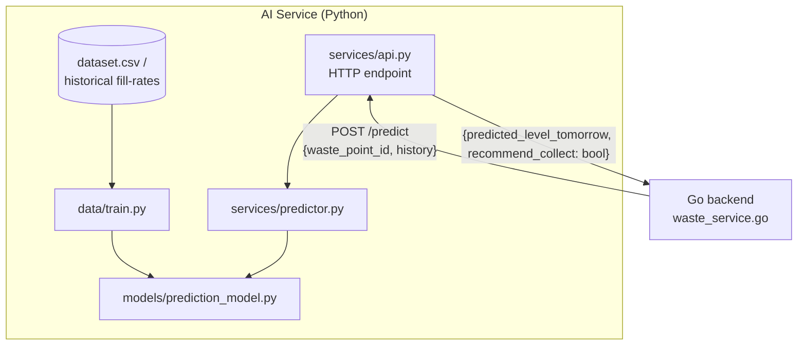
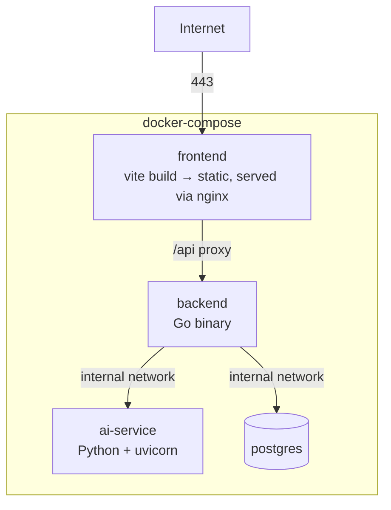

# EcoRoute — System Architecture

**Version:** 1.0
**Status:** Draft for hackathon MVP → production-track document
**Owner:** Engineering team

---

## 1. Overview

EcoRoute is a smart waste management and route optimization platform. It tracks waste collection points across a city, prioritizes which points need urgent collection, computes optimized truck routes, and lets the community report problems (overflowing bins, missed collections, illegal dumping).

The system is composed of three independently deployable services:

| Service | Language / Framework | Responsibility |
|---|---|---|
| **Backend API** | Go (net/http + custom router layer) | Core business logic, auth, routing, persistence orchestration |
| **AI Service** | Python (FastAPI-style service layer) | Waste-level prediction, forecasting |
| **Frontend** | React + Vite | Admin, Driver, and Community-facing UIs |
| **Database** | PostgreSQL | System of record |

This split exists so the AI/prediction workload (Python's strength — data tooling, model training) is isolated from the transactional core (Go — fast, typed, good concurrency for route computation), and neither can take the other down.

---

## 2. High-Level Architecture



**Key decision:** the frontend never talks to the AI service directly. All requests go through the Go backend, which proxies prediction calls. This keeps a single auth boundary, a single API contract for the frontend, and lets the backend cache/aggregate AI results before they hit the client.

---

## 3. Backend — Layered Architecture (Go)

The backend follows a strict four-layer flow. Each layer only knows about the layer directly below it — handlers never touch the database, services never touch HTTP.



**Layer responsibilities:**

- **Middleware** — cross-cutting concerns: JWT validation, CORS headers, request logging, panic recovery so one bad handler can't crash the server.
- **Routes** — pure wiring: maps `METHOD /path` → handler function. No logic.
- **Handlers** — parse/validate the HTTP request, call one or more services, shape the HTTP response (via `utils/response.go`). No SQL, no business rules.
- **Services** — the actual business logic: route optimization algorithm, priority scoring, collection workflow rules, analytics aggregation. Framework-agnostic — could be unit tested without an HTTP server.
- **Repositories** — the only layer allowed to write SQL. One repository per aggregate (`waste_repository`, `truck_repository`, etc.), returning domain models, not raw rows.

This separation matters most for `route_service.go` and `waste_service.go` — the optimization algorithm and priority scoring are the core IP of the product and should be testable in isolation from HTTP and the DB.

---

## 4. Database Schema (ER Diagram)



Migration files map 1:1 to these entities (`002_waste_points.sql` → `WASTE_POINTS`, etc.), plus `007_analytics.sql` for pre-aggregated/materialized reporting tables so `analytics_service.go` doesn't recompute totals from raw rows on every dashboard load.

---

## 5. Core Flow: Route Optimization

This is the product's hero feature and the sequence that should be demo-rehearsed end to end.



**Algorithm note:** `route_service.go` implements nearest-neighbor construction followed by a 2-opt improvement pass — deliberately chosen over a full VRP solver (e.g. OR-Tools) for two reasons: (1) zero external dependency, so it compiles anywhere `go build` runs, and (2) it's fast enough to run synchronously inside a single HTTP request for the point counts this system targets (tens of points per truck, not thousands). If the point count grows into the hundreds per truck, this is the layer to swap for a proper VRP solver — the service interface (`OptimizeRoute(truckID) → Route`) doesn't need to change.

---

## 6. Core Flow: Community Report → Priority Escalation



A report doesn't get silently queued — `report_service.go` calls into `waste_service.go` to immediately bump the affected waste point's status, so it surfaces on the next route optimization run without any manual admin intervention.

---

## 7. Authentication & Authorization



Roles: `admin`, `driver`, `community`. The frontend mirrors this with three route layouts (`AdminLayout`, `DriverLayout`, `CommunityLayout`) plus `AuthLayout` for login — but role enforcement is never trusted client-side. `internal/middleware/auth.go` is the single source of truth: it decodes the JWT and checks the required role per route before the handler ever runs. Passwords are hashed via `utils/password.go` (bcrypt) — plaintext never touches the DB or logs.

---

## 8. AI Service Integration



The AI service is intentionally a thin, stateless HTTP layer — `predictor.py` loads a trained model at startup and serves predictions; training (`train.py`) is a separate offline step, not something that runs per-request. For the MVP, the model is a simple extrapolation over each waste point's historical fill-rate (linear/exponential trend) rather than a deep model — accurate enough to be useful, cheap enough to explain and defend live.

If the AI service is down or slow, `waste_service.go` degrades gracefully: the dashboard shows current levels without the "tomorrow" prediction rather than failing the whole request. This is a hard requirement — a P2 feature must never be able to break a P0 flow.

---

## 9. Frontend Structure

Three role-scoped app shells share one router and one API client:

```
RootLayout
 ├── AuthLayout        → LoginPage
 ├── AdminLayout        → Dashboard, WastePoints, Trucks, Routes, Reports, Analytics
 ├── DriverLayout        → DriverDashboard, MyRoute
 └── CommunityLayout    → CommunityDashboard, ReportWaste, CollectionSchedule
```

All network calls go through `services/apiClient.js` (single axios/fetch instance with the JWT attached), with one service module per domain (`routeService.js`, `wasteService.js`, etc.) mirroring the backend's handler boundaries 1:1. Data fetching + caching per domain is wrapped in a matching hook (`useRoutes`, `useWastePoints`, ...), so pages stay declarative and don't call `fetch` directly.

---

## 10. Deployment Topology



For the hackathon demo, all four containers run on one host via `docker-compose.yml`. Environment-specific config (DB DSN, JWT secret, AI service URL) is injected via `.env`, loaded through `backend/config/env.go` — never hardcoded, never committed (`.env.example` documents the required keys without real values).

**Production-track hardening** (post-hackathon, not required for demo):
- Move Postgres to a managed instance, not a container on the same host.
- Put the AI service behind an internal-only network — it should never be reachable from the public internet, only from the backend.
- Add a reverse proxy (nginx/Caddy) in front of the Go binary for TLS termination.
- Replace `credential.helper store`-style local secrets with a proper secrets manager before this goes anywhere near real deployment.

---

## 11. Priority Alignment (P0 / P1 / P2)

This document's diagrams are ordered by demo priority — if time runs out, cut from the bottom up:

- **P0 (must work):** §4 schema, §5 route optimization flow, §7 auth
- **P1 (should work):** §6 community report flow
- **P2 (nice to have):** §8 AI prediction integration

If the AI service isn't finished by the time-box in Sprint 5, §8 becomes "planned architecture" in the demo narrative rather than a live feature — the graceful-degradation design in §8 means cutting it doesn't break anything else.

---

## 12. Open Questions / Risks

- **Route recompute frequency:** is optimization run on-demand only (button click) or on a schedule as waste levels change? Current design assumes on-demand; revisit if community reports need to trigger automatic re-optimization.
- **Concurrent route assignment:** what happens if two admins optimize routes for the same truck simultaneously? `route_repository.go` should enforce this at the DB level (e.g. a `status` check + row lock on `trucks`), not just in application logic.
- **Photo storage for reports:** `waste_reports.photo_url` assumes external storage (S3-compatible or similar) — not yet decided. For the hackathon, a local static file mount is fine; flag as a known shortcut in the README so it doesn't read as an oversight.
